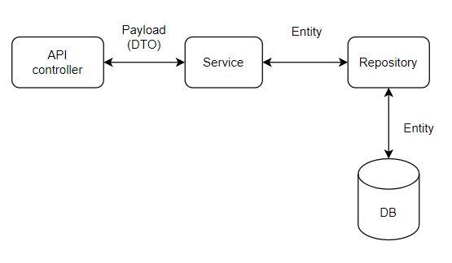

## TeamLog RESTful API Test Server

### Request example

------------

* Post 생성 

``` 
const createPost = (formData) => fetch('/api/posts', {
  method: 'Post',
  body: formData,
  headers: {}
});

const submitPost = () => {
  var data = { 
    contents: "asfasf",
    accessModifier: "PUBLIC",
    commentModifier: "PUBLIC",
    writerId: "string",
    hashtags: ["yaho", "스토리보드"],
    projectId: 9
  }
  const formData = new FormData();
  // file 보낼 것들...
  attachedFiles.forEach((file) => formData.append("files", file));
  // image? video? 그것도 위와 같은 방식으로..
  
  //json으로 보낼 것들
  formData.append(
    "key",
    new Blob([JSON.stringify(data)], { type: "application/json" })
  );

  let response = createPost(formData);
  ~~~ 이어서 구현
```

### Dependencies

------------

* Lombok
* Spring Web
* Spring Security
* Validation
* Spring Data JPA
* MySQL Driver

### Structure

------------



### Additional Explanation

------------

#### Payload

- __Request__
    - __request dto__  ( ex) payload/user/UserRequest.java)
    
        create, update에서 사용 ( 이 또한 분리해야할지 고민 됨. )

<br/>
    
- __Response__
    - __response dto__ ( ex) payload/user/UserResponse.java)
    
        create, update, read에서 사용 
  
    - payload/common/__ApiResponse.java__
        
        {success, message} 가짐.
    
        i ) delete 메소드에서 성공여부를 알리기 위해 사용
        
        ii ) 예외처리 시 사용

<br />

- __위와 같이 구성한 이유__
1. controller에서 ResponseEntity로 httpstatus코드(성공여부판단가능)도 같이 묶어서 반환하기 때문에 create,update,get 기능이 성공적으로 수행되었을 경우는 success 여부를 넣을 필요 없이 바로 데이터를 넘겨도 된다고 생각함.

2. delete가 성공한 경우와 요청 수행 중에 예외처리 된 경우에는 반환할 json데이터가 없으므로 ApiResponse로 성공여부 및 메시지를 반환하려고 함.

### Additional Links

------------

These additional references should also help you:

* [처음 참고했던 사이트...(지금구조랑 많이 다름)](https://bezkoder.com/spring-boot-jpa-crud-rest-api/)
* [Spring API 실습](https://kyhslam.tistory.com/entry/Spring-JPA-API-%EC%8B%A4%EC%8A%B5-01-%EC%A3%BC%EB%AC%B8%EB%AA%A9%EB%A1%9D-%EA%B2%80%EC%83%89?category=892835)
* [RestController, RequestMapping](https://authentication.tistory.com/16?category=782988)
* [JPA 연관관계 매핑](https://velog.io/@ljinsk3/JPA-%EB%8B%A4%EC%96%91%ED%95%9C-%EC%97%B0%EA%B4%80%EA%B4%80%EA%B3%84-%EB%A7%A4%ED%95%91)
* [JPA 기본 어노테이션](https://www.icatpark.com/entry/JPA-%EA%B8%B0%EB%B3%B8-Annotation-%EC%A0%95%EB%A6%AC)
* [JPA Auditing으로 생성일/수정일 자동화하기](https://velog.io/@conatuseus/2019-12-06-2212-%EC%9E%91%EC%84%B1%EB%90%A8-1sk3u75zo9)